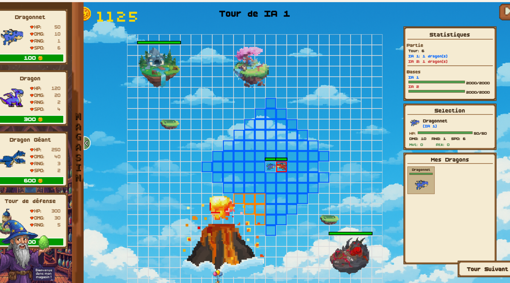
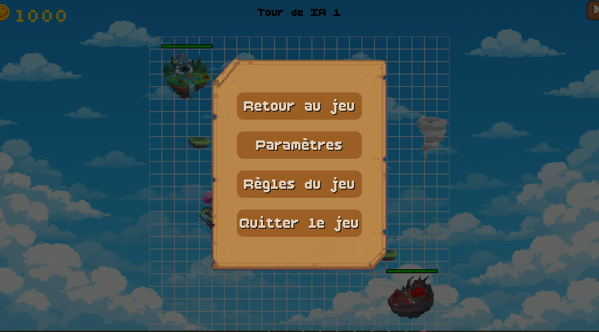

<!-- # Règles et fonctionnement du jeu -->
---

Skyrift est un jeu de combat **stratégique** en 1 contre 1 où des **dragons** s’affrontent jusqu’à la destruction de la base ennemie. Chaque joueur possède une **base** qu’il doit protéger tout en attaquant celle de son adversaire.

## Lancement du jeu 

Une fois le jeu lancé, vous aurez accès à l'écran du menu principal. Pour commencer une nouvelle partie, cliquez sur **START** et vous aurez accès au début du jeu.

## Début de la partie

* Chaque joueur commence avec **100 Skygold**, la monnaie du jeu.

* À chaque tour, vous recevez **75 Skygold** pour renforcer votre armée et préparer vos attaques.

* Des **bourses** de Skygold apparaissent aléatoirement sur la grille et rapportent **50 Skygold** lorsqu’elles sont récupérées.

* Gérez vos **ressources** avec stratégie pour construire une force de frappe efficace et prendre l’avantage sur votre adversaire.

## Déroulement d’un tour

* Le jeu se déroule tour par tour et quand arrive votre tour, plusieurs possibilités s'offrent à vous:
    * **Acheter** une unité (dragon, tour ou autre..) : en cliquant sur votre base, une boutique apparait à l'écran, vous permettant d'acheter ce dont vous avez besoin pour gagner

    !!! warning "Important :"
        Si un dragon occupe le spawn, vous ne pouvez pas en faire apparaître un autre au tour suivant. Planifiez vos attaques avec soin !
    
    * **Déplacer** un dragon : les déplacements possibles s'affichent en cliquant sur un dragon existant

    

    * **Attaquer** un dragon adverse : les attaques deviennent possibles et visibles lorsque votre dragon se tient à une certaine distance de celui d'un ennemi

    

Il vous faudra donc choisir une action à réaliser pour poursuivre le jeu.

## Paramètres

* Au cours de la partie, il vous est également posssible d'accéder aux paramètres du jeu, en cliquant sur l'icone en haut à droite de l'écran. Ce menu concernant les paramètres permet :

    * De consulter à nouveau les **règles du jeu**
    * D’activer ou désactiver les effets **sonores**
    * D’activer ou désactiver la **musique**
    * De **quitter** la partie en cours

## Fin de la partie

* La partie se termine lorsque la base d’un joueur atteint **0 PV**.

* Le joueur ayant détruit la base adverse remporte la **victoire** et le **Skyrift** !
