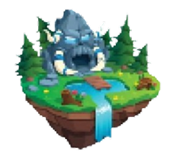

---
Pour faire apparaitre vos dragons et détruire la base ennemie, le jeu contient différents type de structures qui offrent différents effets.

## Les bases

Base alliée                              | Base ennemie
-----------------------------------------|--------------
 | 

* ### La base alliée
    Votre base : fait apparaître les dragons et les tours de défense.

    * Points de vie : 2000 pv

    * Rôle : Point de réapparition (spawn)

    * Objectif : Protéger la base contre les attaques

* ### La base ennemie
    La base adversaire : fait apparaître les dragons ennemis et les tours d'attaque.

    * Points de vie : 2000 pv

    * Rôle : Point de réapparition (spawn)

    * Objectif : Détruire la base ennemie le plus vite possible

## Eléments additionnels

Ile de vie                              | Volcan                             | Tornade                           |
----------------------------------------|------------------------------------|-----------------------------------|
    |   | |

* ### L'Ile de vie
    Une ile mystique aux pouvoirs régénérateurs. 

    * Rôle : Point de récupération de vie 

    * Vie gagnée :  2 pv/tour
     
    * Objectif : Approche toi de celle ci et ses pouvoirs de régénérations prendrons effet sur toi.

* ### Le volcan
    Un endroit bouillant qui serait préférable d'éviter...

    * Rôle : Ralentir les dragons qui s'y aventure.

    * Ralentissement :  1 case/tour
     
    * Objectif : Evite de passer aux abords si tu ne souhaites pas être ralenti.

* ### La tornade
    Un souffle glaçant qui renverse tout sur son passage.

    * Rôle : Ralentir les dragons se trouvant sur son chemin.

    * Ralentissement :  2 case/tour

    * Durée : 5 tours
     
    * Objectif : Fais en sorte de ne pas croiser son chemin si tu veux avancer.

## Caractéristiques

|                         | Base      | Base ennemie    | Ile de vie   | Volcan      |
|-------------------------|-----------|-----------------|--------------|-------------|
| PV                      | 2000      | 2000            | -            | -           |
| Vitesse                 | 6         | 4               | 2            | -           |
| Puissance de tir/dégâts | 10        | 20              | 40           | -           |
| Portée tir              | 1         | 2               | 3            | 3           |
| Blindage / PV           | 50        | 120             | 250          | 300         |

## Effet des structures

* expliquer comment sont les effets sur le jeu

* images sur le jeu

