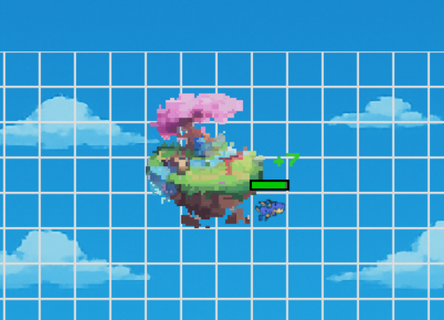

---
Pour faire apparaitre vos dragons et détruire la base ennemie, le jeu contient différents type de structures qui offrent différents effets.

## Les bases

Base alliée                              | Base ennemie
-----------------------------------------|--------------
 | 

* ### La base alliée
    Votre base fait apparaître les dragons et les tours de défense.

    * Points de vie : 2000 pv

    * Rôle : Point de réapparition (spawn)

    * Objectif : Protéger votre base contre les attaques

* ### La base ennemie
    La base adversaire fait apparaître les dragons ennemis et les tours d'attaque.

    * Points de vie : 2000 pv

    * Rôle : Point de réapparition (spawn)

    * Objectif : Détruire cette base ennemie le plus vite possible

## Eléments additionnels

Ile de vie                              | Volcan                             | Tornade                           |
----------------------------------------|------------------------------------|-----------------------------------|
    |   | |

* ### L'Ile de vie
    Une ile mystique aux pouvoirs régénérateurs. 

    * Rôle : Point de récupération de vie 

    * Vie gagnée :  2 pv/tour
     
    * Objectif : S'approcher de celle ci pour que ses pouvoirs de régénérations prennent effet sur toi.

* ### Le volcan
    Un endroit bouillant qui serait préférable d'éviter...

    * Rôle : Ralentir les dragons qui s'y aventurent.

    * Ralentissement :  1 case/tour
     
    * Objectif : Eviter de passer aux abords si tu ne souhaites pas être ralenti.

* ### La tornade
    Un souffle glacial qui renverse tout sur son passage.

    * Rôle : Ralentir les dragons se trouvant sur son chemin.

    * Ralentissement :  2 case/tour

    * Durée : 5 tours
     
    * Objectif : Faire en sorte de ne pas croiser son chemin si tu veux avancer.

## Effet des structures

* Si tu es aux alentours de **l'ile de vie** ton dragon bléssé pourra **regagner de la vie** à chaque tour. Plus ton dragon reste aux abords de celle-ci plus il **augmentera** son nombre total de pv.

* En arrivant autour de l'énorme **volcan**, les dragons subissent des **dégats** liés à la chaleur intense de la zone volcanique. Evite de rester trop longtemps aux alentours du magma, si tu souhaite garder un **maximum** d'unités en vie.

* La tornade fait son apparition tous les **3 tours** et **renverse tout** sur son passage. Pendant ces trois tours, elle inflige des **dégats** aux dragons se situant sur son **chemin**. Pense à planifier tes **déplacements** en fonction de la zone où elle apparait.