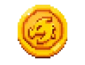
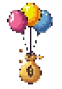

---

<!-- ## Monnaie du jeu -->

Dans ce jeu d'aventure, il vous faudra obtenir des Skygold pour acheter votre armée et défendre votre base.

 

## Les sources de revenus

Pour débuter la partie, chaque joueur dispose de 100 Skygold.
Ces Skygold vous seront utiles pour éloborer vos stratégies.

### Le temps

Le temps est la source de revenus principale. A chaque tour les joueurs sont récompensés par une somme de 75 skygold.

* Revenus :  75 Skygold
* Réccurence : 1 fois par tour

### Les bourses

 

De manière aléatoire, des bourses feront leur apparition dans les cieux. 

* Revenus : 50 Skygold.
* Emplacement : Alétoire

### Récompenses de combat

Vous pouvez gagner des Skygold en éliminant des unités ennemies

Pour chaque unité ennemie éliminée :

/// tab | Dragonnet
``` 
Récompense : 20 Skygold
```
///
/// tab | Dragon 
``` 
Récompense : 50 Skygold
```
///
/// tab | Dragon géant
``` 
Récompense : 75 Skygold
```
///
/// tab | Tour de défénse
``` 
Récompense : 90 Skygold
```
///


## La boutique
* Expliquer a quoi sert la boutique

* Montrer a quoi ressemble la boutique


### Accéder à la boutique
* Expliquer comment utiliser la boutique

* Montrer comment utiliser la boutique sur le jeu 


## Conseils d'achats

!!! info "Information :"
    Mettre des conseils d'acahts pour les joueurs afin d'éviter que
